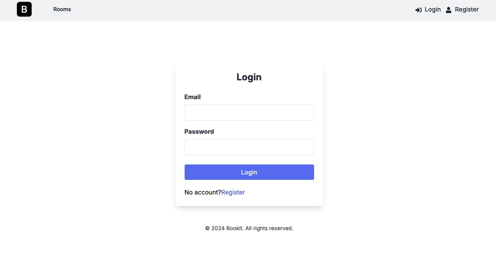
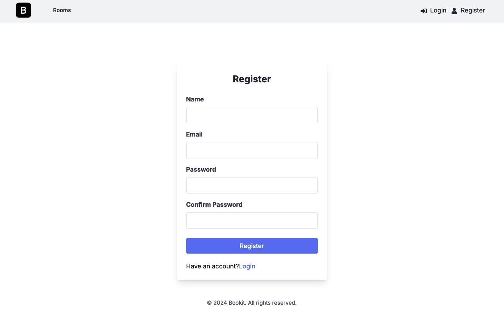
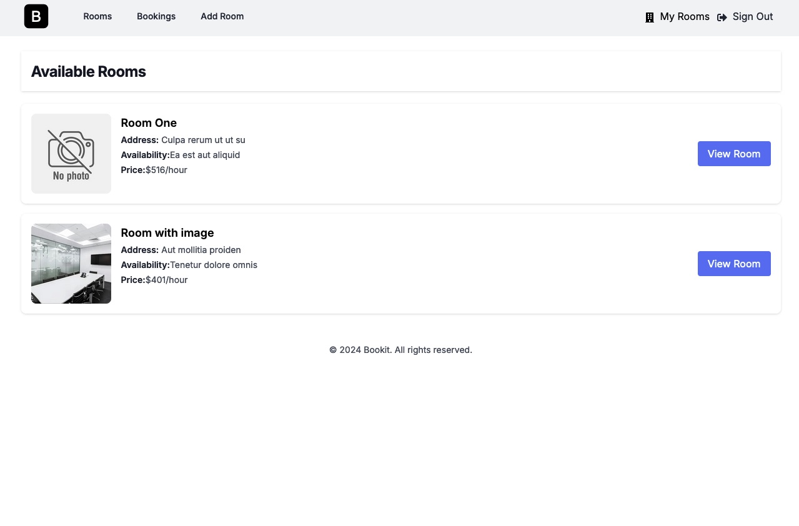
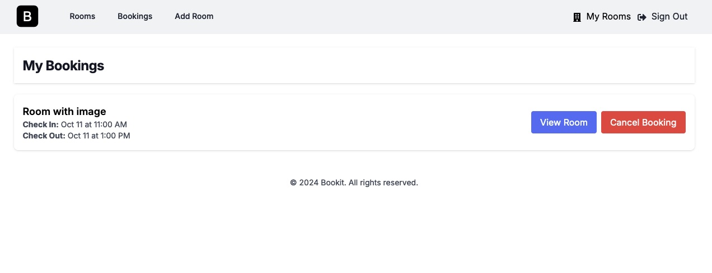
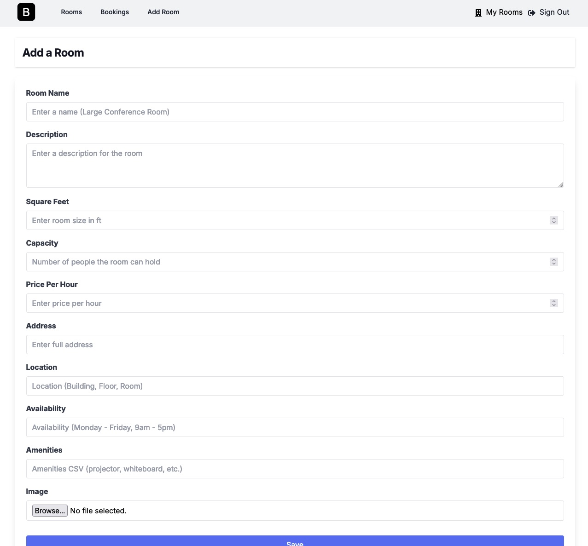

## Bookit - A simple booking system

This is a simple booking system that allows users to book a room for a specific date and time.
The system is build using NextJS, Appwrite and TailwindCSS. It uses Appwrite as a backend service
to store the data. Appwrite is also controlling the user management and authentication.

# BUILD WITH

- HTML
- NextJS
- Tailwind CSS
- AppWrite

# Live Version

https://bookit-coral.vercel.app/

# AUTHOR

- Github: [@mariosknl](https://github.com/mariosknl)
- Twitter: [@mariosknl](https://x.com/MariosKnl)
- Linkedln: [marios-kanellopoulos](https://www.linkedin.com/in/marios-kanellopoulos)
- Portfolio: [marios-kanellopoulos](https://marioskanellopoulos.com/)

# Show your support

Give ⭐️ if you like this project!

# Acknowledgments

Brad Traversy - Traversy Media

### 🤝 Contributing

Contributions, issues, and feature requests are welcome!
Feel free to check the issues page.
